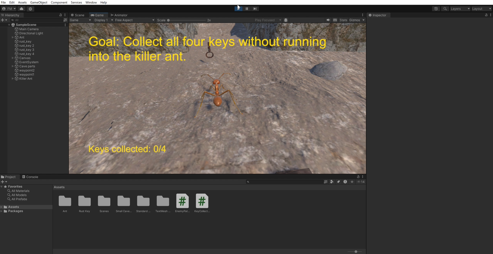

- Developed a 3D simulation game where players control an ant navigating tunnels, collecting keys, and avoiding obstacles
- Designed and coded features for key collection and obstacle avoidance, including visual indicators and game-over conditions
- Created and integrated additional AI-driven ants to challenge the player, utilizing Unity’s physics and scripting systems

